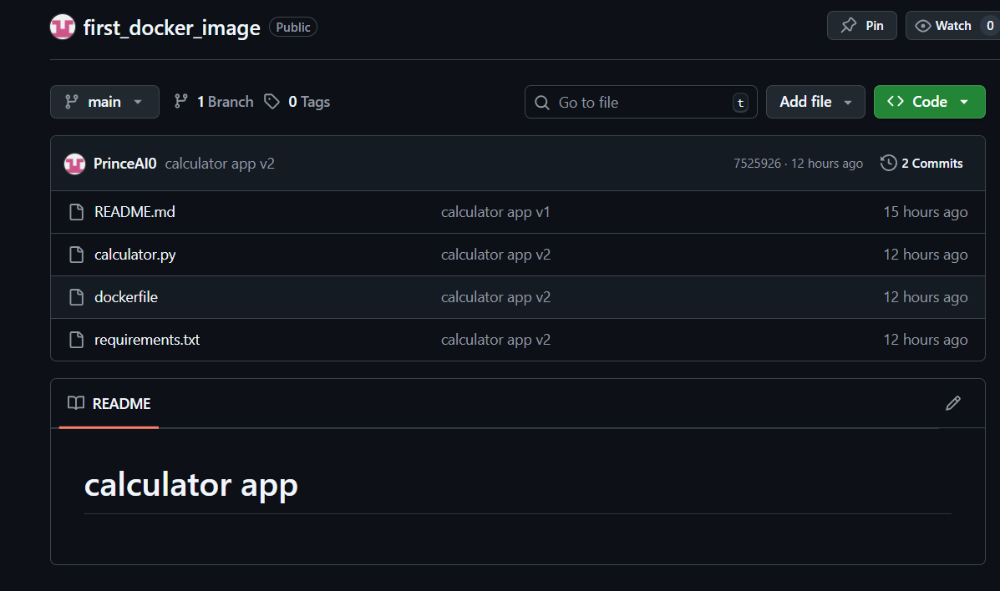
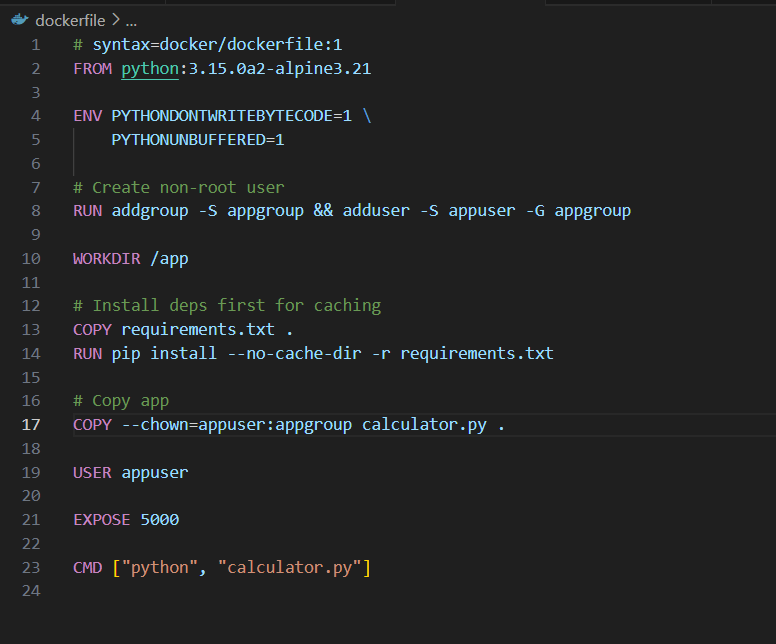
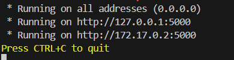

# calculator app Project

1. Create a GitHub account (carefully select your username because it will be your identity for a long time) 
2. ⁠Create and push or fork into your GitHub account a simple Python application  
3. Dockerize the Python App and run it locally  
4. ⁠create a new repo named (first_docker_image) and push all your Dockerfile. 
5. ⁠document your process with screenshots using markdown and push to that same repo..

## step 1
creaate a repo on github


## step 2
pushed a calculator.py to my github


## step 3

- i visite www.https://hub.docker.com/_/python  to get the python image i needed for this project 

- dockerize the calculator.py and run it locally


- to run this command locally i turn on docker desktop
- then we will build the dockerfilke using the below command:
```
docker build -t web-calculator .
```


- we ran the code below to check if the branch is up to date with 'origin/main'.
```
git status
```

- i ran this command below to stages all of these changes together
```
git add .
```

- Then i ran this command to Saves the staged changes and Stores the commit message with the snapshot.
```
git commit -m
```

- we ran this command below to upload you the work to the cloud
```
git push
```


## step 4

- we ran this command below to get our URL for the python app created
```
docker run --rm -p 5000:5000 web-calculator
```


- Result after accessing the URL below
```
http://127.0.0.1:5000/
```

